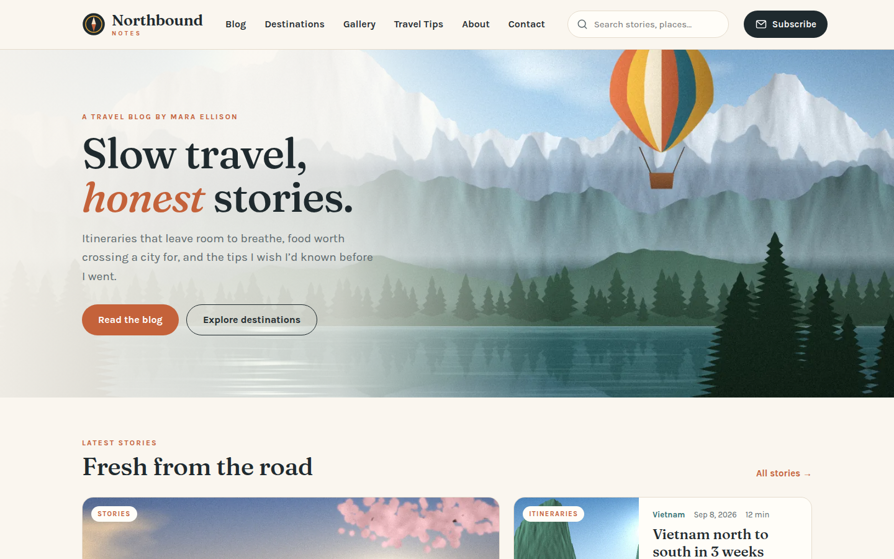
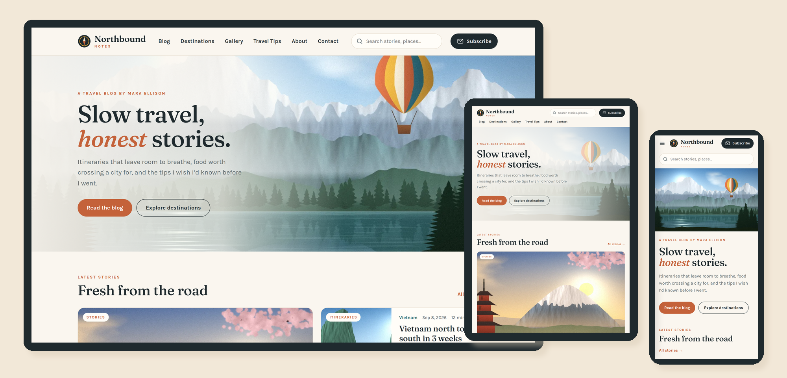

# Northbound Notes — SkyNet Travel Blog Template

A responsive travel blog website template for **ASP.NET Core (.NET 10)**, built on the **SkyNet Framework**.
Free and open source. **100% AI-driven coding — built by Claude.**

[](https://dotnet.microsoft.com/)
[](https://www.nuget.org/packages/TheSkyLite.SkyNet)
[](LICENSE)
[](#100-ai-driven-coding)



> **Fictional blog.** Northbound Notes and its author are invented for demonstration. Countries are real; stories, photos and figures are illustrative. Always check official sources before you travel.

---

## Features

- **9 pages:** Home, Blog, Post, Destinations, Destination, Gallery, Travel Tips, About, Contact
- **Responsive:** desktop, tablet and phone layouts
  - Desktop: inline menu with hover mega menus
  - Tablet: scrolling menu bar, two-column grids
  - Phone: slide-in menu with tap-to-expand sections
- **Site search:** live suggestions across places, stories and tips, served by the page's C# method
- **Blog:** category chips, continent filter, sorting and *Load more*
- **Post page:** `Post?id=first-morning-in-kyoto` — article, tags, author box, related stories, older/newer links
- **Destinations:** 12 countries with continent filter; each has its own page `Destination?c=japan` (overview, best season, highlights, photos, stories)
- **Gallery:** masonry grid filtered by theme and continent; the lightbox image, caption and previous/next buttons come from the server
- **Travel Tips:** tips for 8 travel types, plus a **packing-list builder** — pick type, days and climate, and the server builds the checklist
- **Newsletter:** signup on every page, checked on the server (demo — nothing is stored)
- **Contact:** form with server-side validation (demo — nothing is sent)
- **Painted artwork:** 99 WebP illustrations — hero, banners, 12 countries, 32 post covers, 36 gallery photos — painted in code by Claude; no stock photos
- **No front-end build:** plain HTML, CSS and vanilla JavaScript; no npm, no bundler, no SPA framework



---

## Getting started

**Requirements:** .NET 10 SDK and Visual Studio (or any editor with the `dotnet` CLI).

```bash
git clone https://github.com/hkim6000/SkyNet-TravelBlog-Asp.net.Core-Full-Source.git
cd SkyNet-TravelBlog-Asp.net.Core-Full-Source
dotnet run
```

Or open `Travel.csproj` in Visual Studio and press **F5**.
The SkyNet package (`TheSkyLite.SkyNet`) restores automatically from NuGet.
The app opens on **Home** — the startup page set in `appConfig/application.cfg`.

---

## Project structure

```
Travel/
├── appConfig/application.cfg     app settings and folder names (startup page = Home)
├── codes/                        page classes (C#)
│   ├── Models/TravelModel.cs     data DTOs
│   ├── Home.cs  Blog.cs  Gallery.cs  Tips.cs  ...
├── htmls/                        page markup
├── scripts/                      page JavaScript
├── styles/                       page CSS
├── data/site.json                continents, countries, posts, photos, tips
├── images/
│   ├── banners/                  page and country banners (WebP)
│   ├── places/                   country cards (WebP)
│   ├── posts/                    post covers (WebP)
│   ├── gallery/                  gallery images (WebP)
│   ├── hero.webp
│   └── logo.svg
├── Properties/launchSettings.json   hot reload off
└── Program.cs
```

### One page = four files, one name

| File | Holds |
|---|---|
| `codes/Gallery.cs` | the page class (`: WebPage`) and its server methods |
| `htmls/Gallery.html` | markup with `{plhd_*}` placeholders |
| `scripts/Gallery.js` | one IIFE namespace, `GalleryJs` |
| `styles/Gallery.css` | styles, every class prefixed (`ga-`) |

Each page is self-contained: its own CSS prefix, its own script and its own C# methods.

---

## SkyNet in action

The browser calls a C# method; the method returns an `ApiResponse`; only those parts of the page change.
One request can return one or more instructions, applied at the same time.

```js
// scripts/Tips.js
$ApiRequest('Tips/Pack', JSON.stringify([
    { key: 'type', vlu: 'family' },
    { key: 'days', vlu: '14' },
    { key: 'climate', vlu: 'cold' }
]));
```

```csharp
// codes/Tips.cs
public async Task<ApiResponse> Pack()
{
    ApiResponse response = new ApiResponse();
    ...
    response.SetElementContents("tp-pack", sb.ToString());
    return response;
}
```

| Page | Request | Response |
|---|---|---|
| every page | `Search` | suggestion list + open it |
| every page | `Subscribe` | message + clear the field |
| Blog | `Filter`, `More` | grid + count + load-more button |
| Destinations | `Filter` | country cards + count |
| Gallery | `Filter`, `View` | grid + count; lightbox content + open it |
| Travel Tips | `Filter`, `Pack` | tips + count; packing checklist |
| Contact | `Send` | field errors or confirmation + clear form |

Learn more: [SkyNet Developer Guide](https://www.theskylite.com/documents/SkyNet_Developer_Guide.html)

---

## Customize it

- **Content:** edit `data/site.json` — countries, posts (title, excerpt, body paragraphs), photos and tips
- **Blog name:** search and replace `Northbound` in `htmls/` and the page titles in `codes/`
- **Colors and fonts:** change the CSS variables at the top of each page's stylesheet (`--hm-terra`, `--hm-sea`, `--hm-serif`, …)
- **Real photos:** replace any WebP in `images/` with your own photos and keep the same file names, or update the paths in `data/site.json`

> Newsletter, contact form and social links are placeholders — connect them to your own systems.

---

## 100% AI-driven coding

Every file in this template — C#, HTML, CSS, JavaScript, the painted artwork and the data — was generated by Claude (Anthropic's AI) from a short instruction, directed and reviewed by the author.
No line was written by hand.

| | |
|---|---|
| Pages | 9 |
| Lines of code | ~9,500 (C#, HTML, CSS, JavaScript) |
| Images | 99 painted WebP + SVG logo |
| Countries / posts / photos / tips | 12 / 32 / 36 / 40 |
| Lines written by hand | 0 |

SkyNet's simple, predictable page model (one class, four files, `$ApiRequest` → `ApiResponse`) is what makes this possible:
the rules are few and consistent, so AI can generate complete, working pages with very few errors.

---

## License

- **This template** (all source files, artwork and data in this repository): [MIT License](LICENSE) — free to use, modify and redistribute, including commercially.
- **SkyNet Framework** (`TheSkyLite.SkyNet` NuGet package): proprietary, free to use including commercial use; see the license included in the package.

---

## Links

- SkyNet Framework: https://www.theskylite.com
- NuGet package: https://www.nuget.org/packages/TheSkyLite.SkyNet
- Template #1 — Beauty store: https://github.com/hkim6000/SkyNet-BeautyWebsite-Asp.net.Core-Full-Source
- Template #2 — Pharma company: https://github.com/hkim6000/SkyNet-PharmaWebsite-Asp.net.Core-Full-Source
- SkyNet project template: https://github.com/hkim6000/ASPNETCoreEmpty.SkyNet

© 2026 HC Kim
